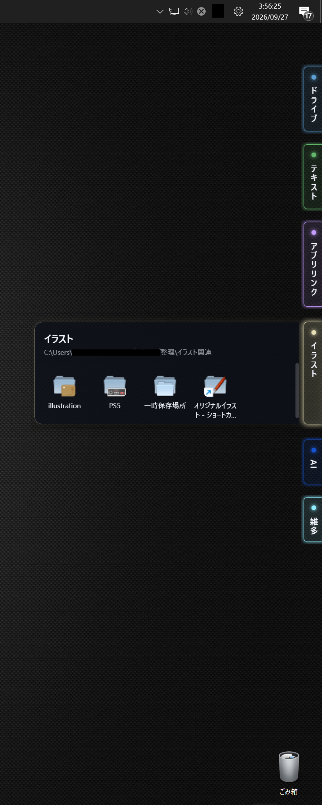
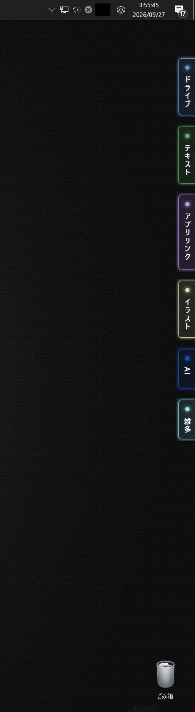
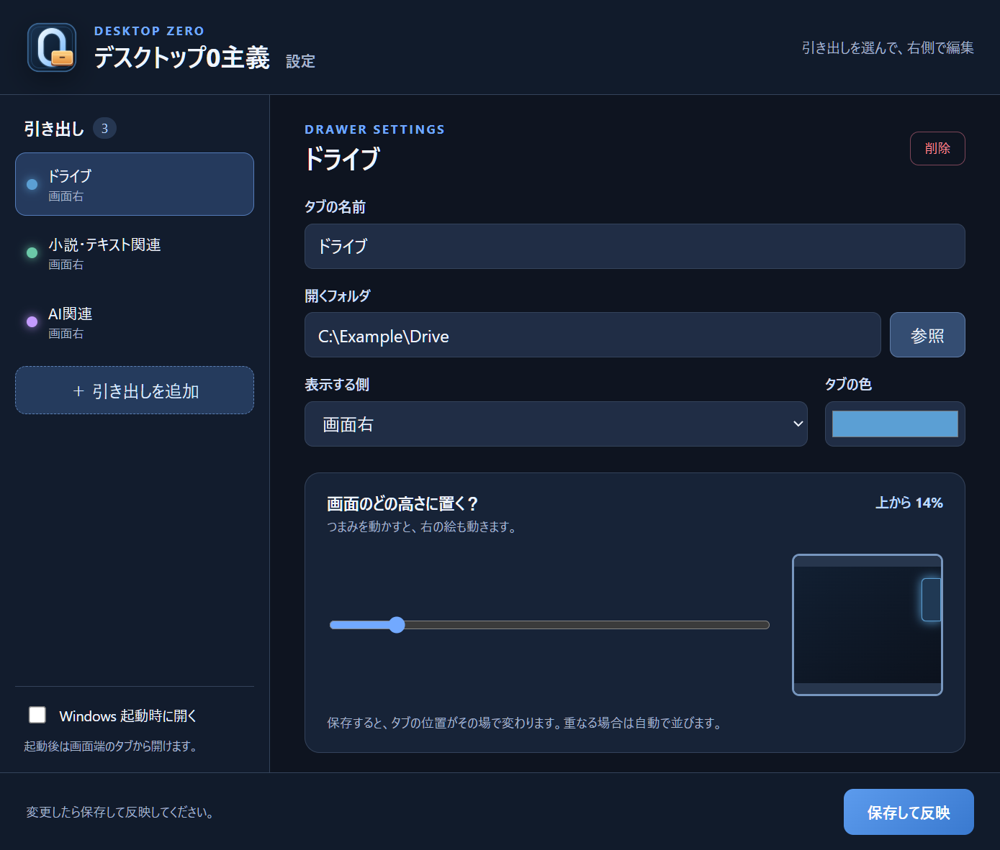

# デスクトップ0主義 / Desktop Zero

## デスクトップ、散らかってない？

「あのファイル、どこだっけ？」

「フォルダ増えすぎて、もう何が何だかわからない」

「この画像だけは絶対に表へ出しておきたくない」

そんなあなたに朗報です。

**デスクトップ0主義**は、好きなフォルダを画面端の「引き出し」に登録して、
ファイルやショートカットをすぐ呼び出せるWindows用デスクトップ整理アプリです。

必要なときだけ引き出して、使い終わったらしまう。

デスクトップはすっきり。見た目はスマート。

これで今日から、シゴデキ大人のデスクトップを演出できます。

> **「デスクトップ？ ああ、俺は何も置かない主義。」**

**片付いているのではない。隠しているだけです。**

でも、0なら問題ない。

### 実際の画面 / Screenshots

| 引き出しを開いた状態 / Drawer open | タブだけの状態 / Tabs only |
| :---: | :---: |
|  |  |

### できること

- 好きなフォルダを、いくつでも引き出しとして登録
- タブの名前、色、左右の配置、高さを引き出しごとに設定
- 画面の見本を見ながら位置を調整し、「保存して反映」ですぐ確認
- フォルダの中身に合わせて引き出しの高さを調整。画面に収まる範囲なら複数を同時に開ける
- Windows 起動時に自動で開くか選択

### ダウンロード

[最新版をダウンロード](https://github.com/Geek0426/DesktopZero/releases/latest)

**Windows 64ビット用**です。Releases の Assets から、使い方に合うものを選んでください。

| ファイル | 向いている使い方 |
| --- | --- |
| `DesktopZero-1.0.0-Setup.exe` | 普段使い向け。インストールして使います。デスクトップにショートカットは作りません。 |
| `DesktopZero-1.0.0-Windows.exe` | インストールせずに試せます。起動時に展開するため、表示まで時間がかかる場合があります。 |

この版にはデジタル署名がありません。Windows が警告を表示する場合があります。ダウンロード元を確認してから実行してください。

### 最初にすること

1. アプリを起動すると設定画面が開きます。左側の「＋ 引き出しを追加」を押します。
2. 「タブの名前」を入力し、「開くフォルダ」の「参照」から使いたいフォルダを選びます。フォルダの中身をアプリへ移動する必要はありません。
3. タブを置く側と色を選びます。「画面のどの高さに置く？」のつまみを動かすと、右の見本で位置を確認できます。
4. 右下の「保存して反映」を押します。画面端にタブが現れ、位置の変更もその場で反映されます。

引き出しを増やすときは、同じ手順で追加できます。位置が重なる場合は、画面内に収まるよう自動で並びます。

### 引き出しの使い方

- 画面端のタブをクリックすると開閉します。中のフォルダやファイルは**ダブルクリック**で開きます。
- 引き出しの幅は5項目が横に並ぶ大きさです。項目が少なければ高さは低くなり、多い場合は中をスクロールできます。
- 複数の引き出しを同時に開けます。画面の高さが足りないときは、古く開いた引き出しから閉じます。
- 引き出しを開くたびにフォルダの中身を読み直します。元のフォルダで項目を追加・削除した場合も、開き直すと表示に反映されます。

### 設定を変える・終了する

画面右下の通知領域にある「0」のアイコンをクリックすると、設定を開くメニューが出ます。アイコンが見えない場合は、通知領域の「∧」を押してください。同じメニューから引き出しの再表示とアプリの終了もできます。

設定画面では、左の一覧から引き出しを選び、右側で内容を編集します。変更後は「保存して反映」を押してください。左下の「Windows 起動時に開く」を選ぶと、次回から自動で起動します。初期状態はオフです。

設定から引き出しを削除しても、元のフォルダやファイルは削除されません。

---

## Desktop Zero

### Is your desktop a mess?

"Where the hell did I put that file?"

"Why do I have this many folders?"

"And maybe this particular image really shouldn't be sitting out in the open."

Good news.

**Desktop Zero** is a small Windows app that lets you browse your folders, files, and shortcuts from drawers tucked along the edge of your screen.

Pull them out when you need them.

Put them away when you're done.

Clean desktop. Smart appearance.

Now you, too, can enjoy the sophisticated desktop of someone who definitely has their life together.

> **"My desktop? Oh, I don't keep anything on it. It's a principle."**

**It's not organized. It's just hidden.**

But if the desktop says zero, who's counting?

### Features

- Add as many folders as you like, each with its own tab name, color, side, and position.
- Adjust a tab's position with a slider and an on-screen preview. Save to apply changes immediately.
- Drawer height adapts to the number of items. Open multiple drawers when they fit on screen.
- Choose whether the app starts with Windows.

### Download

[Download the latest release](https://github.com/Geek0426/DesktopZero/releases/latest) for **64-bit Windows**.

- **Setup.exe:** Recommended for everyday use. It installs the app without adding a desktop shortcut.
- **Windows.exe:** Portable version; no installation required. It may take longer to start because it extracts on launch.

This build is not digitally signed, so Windows may show a security warning. Verify the download source before running it.

### Getting started

1. Launch the app. In the Settings window, select **＋ 引き出しを追加** (Add drawer).
2. Enter a tab name and use **参照** (Browse) to select the folder you want to open.
3. Choose the screen side and tab color. Move the position slider and check the preview.
4. Select **保存して反映** (Save and apply). The tab appears at the screen edge immediately.

Click a tab to open or close its drawer. Double-click a file or folder inside to open it. The drawer loads the folder contents each time it opens. If there are more items than fit, scroll inside the drawer. You can keep multiple drawers open when there is enough screen space.

### Settings and quitting

Click the **0** icon in the Windows notification area to open Settings, show the drawers again, or quit. If the icon is hidden, expand the notification area with **∧**.

In Settings, select a drawer from the list on the left and edit it on the right. Press **保存して反映** after changes. The **Windows 起動時に開く** option (Start with Windows) is off by default.

Removing a drawer from Settings does not delete its folder or files.

